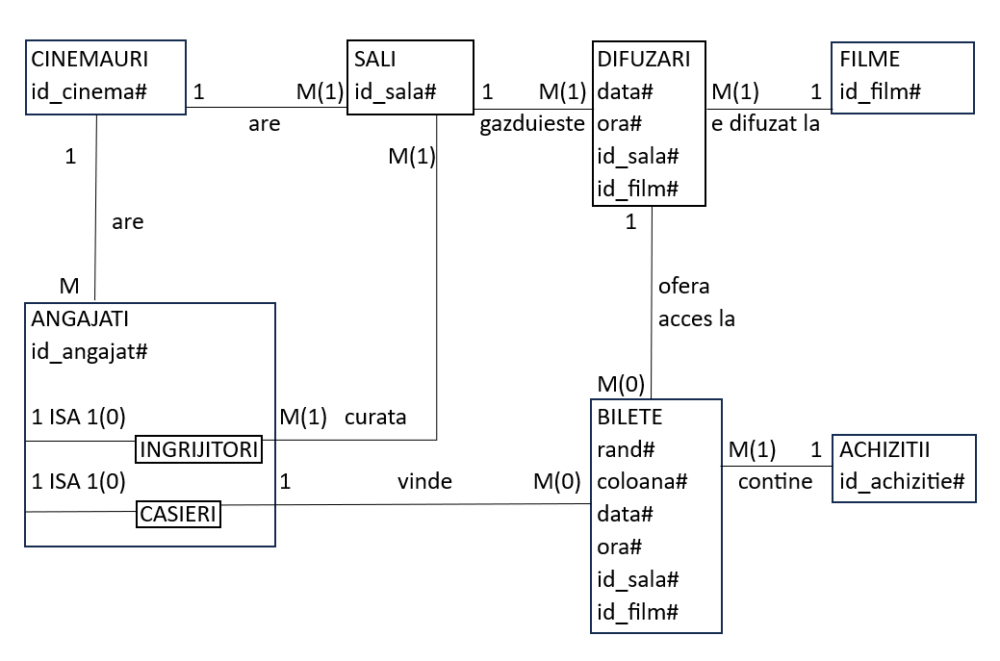
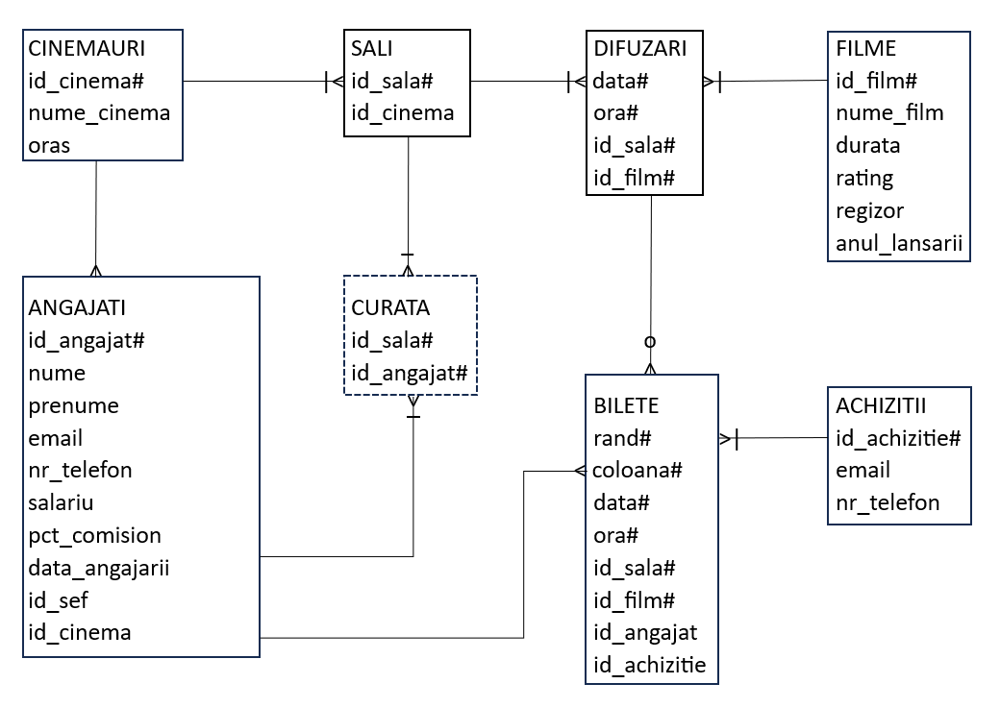

# Cinema web application - Python, Django
## Dezvoltarea Aplicatiilor Web - Django (2024-2025)

## Table of contents
+ [Description](#description)
+ [Requirements](#requirements)   
+ [Setup](#setup)
  + [Downloading files](#downloading-files)
  + [Creating _.env_](#creating-env)
  + [Creating the database](#creating-the-database)
  + [Populating the database](#populating-the-database)
+ [Diagrams](#diagrams)


### Description

Full-stack web application with user authentication, email verification, security checks and warnings, role-based access control, shopping cart, invoice generation and admin dashboard to manage users, groups, offers, and permissions. Data is stored in PostgreSQL, and the app runs on localhost.

### Requirements

+ Check if you have python installed \(`python --version`\). If not, install latest Python 3 version from this [page](https://www.python.org/downloads/).
+ Install latest or any \(LTS preferably\) version of Django. More details [here](https://www.djangoproject.com/download/).


    <ins>latest</ins>: `pip install django` or `python -m pip install Django`  
    <ins>specific version</ins>: `python -m pip install Django==[version]`  

After installation check version: `python -m django --version`

### Setup
#### Downloading files
+ `git clone https://github.com/mateiungureanu/DAW-2024-proiect`
+ `cd DAW-2024-proiect`
#### Creating _.env_
+ `echo "" > .env` 
+ Open _.env_, then paste the following lines, replacing the bracketed text with the relevant info.

> **NOTE**
> The detailed sections regarding the _secrets_ apply specifically to Gmail accounts.

```
SECRET_KEY='[your-secret-key]'  
EMAIL_HOST='smtp@gmail.com'  
EMAIL_HOST_PASSWORD='[your-email-host-password]'  
EMAIL_PORT='587'  
EMAIL_HOST_USER='yourgmailaddress@gmail.com'  
DEFAULT_FROM_EMAIL='Your Name <yourgmailaddress@gmail.com>'
EMAIL_ADMIN='yourgmailaddress@gmail.com'
```

EMAIL_HOST_USER and EMAIL_ADMIN do **not** have to be the same address.
+ To generate the SECRET_KEY: 
  + `python -c "import secrets; print(secrets.token_urlsafe(50))"`
  + Copy the result and paste it into _.env_  
+ To generate EMAIL_HOST_PASSWORD:

  + Go to [Google account security](https://myaccount.google.com/security) and activate 2-Step Verification. You must be logged into a personal account and not have *Advanced Protection* active. If your Google account has 2-Step Verification set up only for security keys it won't work.
  + Go to [App passwords](https://myaccount.google.com/apppasswords), set a name and you will receive your password. Copy it and paste it into _.env_, **without** the lines between the letters.  

  Learn more about app passwords [here](https://support.google.com/accounts/answer/185833).

> **CAUTION**
> Do not share your _secrets_! Check if _.env_ is ignored by _.gitignore_ \(`git status -- .env`\) before pushing to Git.

#### Creating the database
+ `pip install psycopg2`
+ Download PostgreSQL from this [link](https://www.postgresql.org/download/). Make sure you check pgAdmin4.
+ Open pgAdmin4 and connect using the password chosen during installation.
+ In the left panel, Servers \> PostgreSQL \[your-postgresql-version\] \> Databases, right click on Databases and select Create \> Database..., name it "proiect", then click Save.
+ Under _proiect_ database, right click on Schemas and select Create \> Schema..., name it "django", then click Save.
+ Click on _proiect_ database, then press Alt+Shift+Q to open Query Tool. Paste the following lines then press F5 or click execute script. 
```
CREATE USER matei WITH ENCRYPTED PASSWORD 'matei';  
GRANT ALL ON DATABASE proiect TO matei;  
GRANT ALL ON SCHEMA django to matei;  
ALTER ROLE matei SET search_path = django, public;  
GRANT ALL PRIVILEGES ON ALL TABLES IN SCHEMA django TO matei;  
GRANT ALL PRIVILEGES ON ALL SEQUENCES IN SCHEMA django TO matei;  
GRANT ALL PRIVILEGES ON ALL FUNCTIONS IN SCHEMA django TO matei;  
```
+ `python manage.py makemigrations aplicatie1`
+ `python manage.py migrate`
+ `python manage.py createsuperuser` -> \[your-name\] -> \[your-email\] -> \[your-password\]  
These are not the same as those in _.env_; these are for a profile at http://127.0.0.1:8000/admin \(page accessible only while the server is running\).
#### Populating the database
+ Add PATH Variable _your\postgresql\download\location\PostgreSQL\\[your-postgresql-version\]\bin_.  
Example: _C:\Program Files\PostgreSQL\17\bin_
+ Run the following commands:
```
psql -h localhost -U matei -d proiect -f "data\cinemauri.sql"  
psql -h localhost -U matei -d proiect -f "data\angajati.sql"  
psql -h localhost -U matei -d proiect -f "data\sali.sql"  
psql -h localhost -U matei -d proiect -f "data\filme.sql"  
psql -h localhost -U matei -d proiect -f "data\difuzari.sql"  
psql -h localhost -U matei -d proiect -f "data\achizitii.sql"  
psql -h localhost -U matei -d proiect -f "data\bilete.sql"
```
+ `python manage.py runserver`
+ Go to http://127.0.0.1:8000/admin and login using the superuser credentials, then create a group called "Administratori_angajati" with the following permissions: _Can add angajati_, _Can change angajati_, _Can delete angajati_, _Can view angajati_, and a group called "Moderatori" with the following permissions: _Can add log entry_, _Can change log entry_, _Can delele log entry_, _Can view log entry_, _Blocheaza utilizatori_, _Editeaza campurile nume, prenume, email_, _Can view user_.
+ Go to http://localhost:8000/aplicatie1/user_login to log in and access the full features of the site.

### Diagrams





For a better understanding of the database visit my [SGBD project](https://github.com/mateiungureanu/SGBD-2024-proiect) or my [BD project](https://github.com/mateiungureanu/BD-2023-proiect).